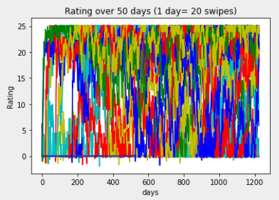
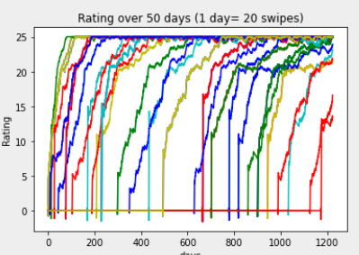
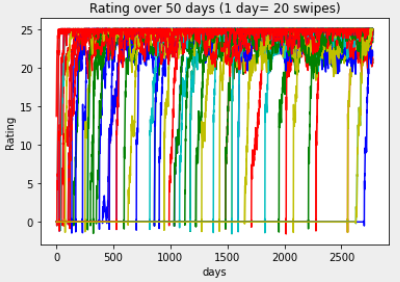

<h1>(pseudo) Glicko Rating Algorithm</h1>

Ever wondered what that scene from "The Social Network" where Edwardo writes an algorithm on Mark's dorm room window, really meant? The algorithm, popularly a chess rating algorithm has been used over the years many times by networking and dating sites as popular as Tinder among many others. Let's study a version of the algorithm made by me as an interesting side project.
There are 3 main parameters that I've implemented-
<ol>
    <li> Erratic Behaviour(1 to 1000): because the real world has real ups and downd unexplainable by algorithms</li>
    <li> Decrease Ratio(1 to 10): how much do you want to penalize a player for his failure to match up?</li>
    <li> Number of Tests(However much patience you have. Keep it around 100): the number of players in the game. Keep this one low if you expect faster results</li>
</ol>
Insert the values to see a graph of all the players (competing with each other) and getting to the top over time

The model is based around social media success and rating over time. So don't be surprised when everyone reaches the top eventually! Monitor how each parameter changes the direction and momentum of the players.
 
<figure>
    <figcaption> The model outputs the following at erraticness=1000, decrease ratio=2, tests=100</figcaption>
<figure>
 
 
 
<figure>
    <figcaption> The model outputs the following at erraticness=250, decrease ratio=10, tests=50</figcaption>
<figure>
    
 
 
<figure>
    <figcaption> The model outputs the following at erraticness=800, decrease ratio=9, tests=75</figcaption>
<figure>
    
 
 
 

As we can see that the erratic behaviour of the model controls a linear line and adds an element of realism to the program. The decrease ratio controls rapid growth to the top, and enables slow growth. As the number of tests increase however, the sample space increases as well, resulting in a graph that seems to be too rapidly growing (as seen in fig 3) but it is because the timegap is interpolated.
